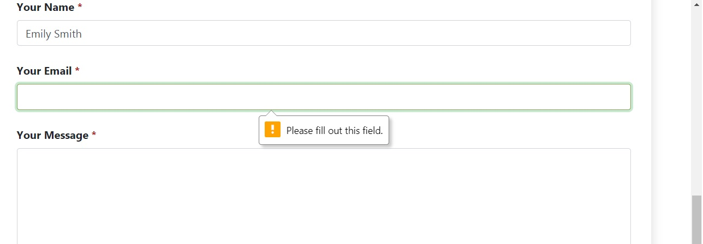

# My Veggie Food - Testing details

#### <a href="https://github.com/cotebarrientos/3rd-milestone-project-my-veggie-food/blob/master/README.md" target="_blank">Main README.md file</a>
#### <a href="https://my-veggie-food-2020recipes.herokuapp.com/" target="_blank">View Website</a>

## Testing

The testing process is outlined below. It includes:

- Validating HTML, CSS, Javascript and Python code.
- Testing website compatibility on different browsers.
- Testing responsiveness in different screen sizes.
- Manually testing the functionality of the links.
- Manually testing creating an user account.
- Manually trying to log out of the created account.
- Manually testing proving that the user is logged in.
- Manually testing the functionality of creating a recipe.
- Manually testing the functionality of editing a recipe.
- Testing manually the function of delete a recipe.
- Manually testing the search bar.
- Manually testing on Contact page, checking the contact form is working correctly.

## Validating HTML, CSS, Javascript and Python code.

### HTML

My HTML code has passed through the <a href="https://validator.w3.org/#validate_by_input" target="_blank">W3C Markup Validation Service.</a> Passed tests without issues, just some warnings.

### CSS
I checked my CSS code with the <a href="https://jigsaw.w3.org/css-validator/" target="_blank">W3C Markup Validation Service</a>. This test did not produce any error.

### JavaScript

I used <a href="https://jshint.com/" target="_blank">JSHint</a> to check my JavaScript files. Passed tests without issues

### Python

I used <a href="https://github.com/psf/black" target="_blank">Black Formatter</a> and <a href="https://flake8.pycqa.org/en/latest/" target="_blank">Flake 8</a>. With these tools, my Python file passed the tests. But when I used <a href="http://pep8online.com/" target="_blank">PEP8 online</a>, it alerted me that my lines were too long, the problem with shortening them was that they would break the code.

## Compatibility with different browsers

In order to ensure that the website would work properly in the following browsers, responsiveness tests, button and link checks were done, as well as tests on the look of the website to ensure that the colors, images and fonts used would display correctly.

- Mozilla Firefox
- Google Chrome
- Microsoft Edge
- Apple Safari

## Responsiveness in different screen sizes

I have made the following response tests in order to ensure that the website operates correctly and at the same time that its components are seen harmoniously arranged in different screen sizes, so that I used the following tools to help me.

- **Responsinator**: This website was used to simulate different screen sizes of mobile devices. This was really useful, because it showed in real time the aspect of the tested website, helping to discover different responsiveness problems.

Here as you can see, there are some screenshots of how the website looks in different screen sizes.

- **Mozilla Firefox**: This browser was used to check the behavior of the web page in different screen sizes using the Developer Tools. Tests consisted in testing the appearance of the fonts used, the aspect of colors and backgrounds, the order and space used by the different elements that make up the web page.

- **Google Chrome**: This browser was used to check the behavior of the web page in different screen sizes using the Developer Tools. As in the previous browser, different tests were performed checking the aspect of the font used, colors and backgrounds, and finally, the space used by the elements of the website. In addition, a contrast was made between both browsers, checking for any existing differences.

- **Xiaomi Mi A1**: This mobile device was used to test the behavior of the website, using browsers such as Chrome, Mozilla Firefox and DuckDuckGo.

- **Xiaomi Poco x3**: This mobile device was used to test the behavior of the website, using browsers such as Chrome, Mozilla Firefox and DuckDuckGo.

## Manually testing the functionality of the links

The following test were made to check that all links responded as they should:

- Menu bar items were clicked on from each page to make sure that they navigate to the correct page.
- Clicking on the logo in the menu bar leads the user back to the home page.
- All buttons were clicked on to check that they take the user to the correct page.
- The registration form button is only active when all fields are completed.
- The login form button is only active when the user completes the required fields.
- The submit button is only activated if both the form to add or edit recipes is fully completed.
- The button to delete recipes is only activated if the user confirms this action in the modal window.
- The contact form "Send Message" button only accepts the form when it has completed with all required fields filled in. After that, the Send Message button opens a modal window with a successful message as expected.
- The scroll back to top button in the Analytics page works properly.

## Manually testing creating an user account.

1. First I tried to create an account without filling out any fields, when I did this, the registration form did not allow me to do so. **Result: passed.**

2. The second test consisted of filling in all the fields correctly and pressing the button to register. The expected result is that the user's profile should appear. **Result: passed.**

## Manually trying to log out of the created account.

1. In the account created, to test that the logout function works correctly, select it, and the expected result is that it shows a flash message indicating that everything has gone correctly. **Result: passed.**

## Manually testing proving that the user is logged in.

1. The first test consisted in giving an incorrect password, the expected result is that the user cannot enter and at the same time it shows a flash message indicating the problem, it is the same if the user writes an incorrect user name. **Result : passed.**

2. The next test consisted of filling out everything correctly in order to log in. Once the user logs in, if he or she does not have any recipes, a message should appear indicating that there are no recipes and a button should also appear inviting the user to create his or her first recipe. In the same way, 3 new links must appear in the navigation bar: Profile, Add Recipes and Logout. **Result: passed.**

## Manually testing the functionality of creating a recipe.

1. This test consisted in creating the first recipe for the user. Here I tested all the defense mechanisms, for example, maximum number of characters per field, try to enter a string in the integer fields, and even enter low resolution images, I passed all the tests without problems. Also try to create a recipe without filling a field, but as all fields are required, it was not possible. **Result : passed.**

2. The following test consisted in filling out the form correctly and pressing the send button, the expected result is that it sends you back to the "All" category and displays a flash message. **Result: passed.**

3. The next test consisted of reviewing the user profile, the expected result is to find the new recipe and you should change the appearance of his/her recipe.  **Result: passed.**

## Manually testing the functionality of editing a recipe.

1. The new test consisted in trying to edit a recipe that was not from this user, the expected result is that the buttons to edit, add or delete the recipe do not appear if it does not belong to the user. **Result: passed.**

2. The next test consisted in editing the user's recipe, the expected result is that the form to be edited loads all the fields with the previous information. **Result: passed.**

3. Once the user has modified something, in this case in tips, the expected result is that it is modified correctly and that the user is redirected to the same recipe. In addition, a flash message should appear at the top indicating that everything has been successful. **Result: passed.**

## Testing manually the function of delete a recipe.

1. In order to do this test, create a random recipe without much production to show the function of deleting recipes. The expected result is that when the user presses this button, should appear a modal window asking this if he/she is really sure to do this action, since once done, the recipe will be deleted forever, to press cancel, the user will be redirected to the same recipe, but if this choose to delete it, will be redirected to his/her user profile, which will appear a flash message stating that everything went well. **Result: passed.**

## Manually testing the search bar.

1. The first test consisted in pressing the search button without entering anything, the expected result is that it shows a message saying that the user must write something. **Result: passed.**

2. The next test consisted of searching for something that is not on the site, the expected result is that a special message appears indicating that there are no search results. **Result: passed.**

3. The last test consisted in looking for something that if it was on the website, for example, carrot. The expected result is that some cards appear showing the recipes in an orderly and intuitive way for the user. **Result: passed.**

## Manually testing on Contact page

The contact form was made responsive using the EmailJS service. In order to test that the contact form works properly, I did the following tests:

1. I tried submitting the form without the **name**.

2. I tried submitting the form without the **email**.

3. I tried submitting the form without the **message**.

As you can see, the contact form produced the correct error message as expected.

The following test consisted of filling out the entire contact form and checking that the message was indeed sent.

- As you can see, the message was sent correctly, and a modal window appears with a message that warns us that the message was indeed sent.

- In this screenshot, you can see that the message has indeed reached the email that has been used to receive the users' messages.